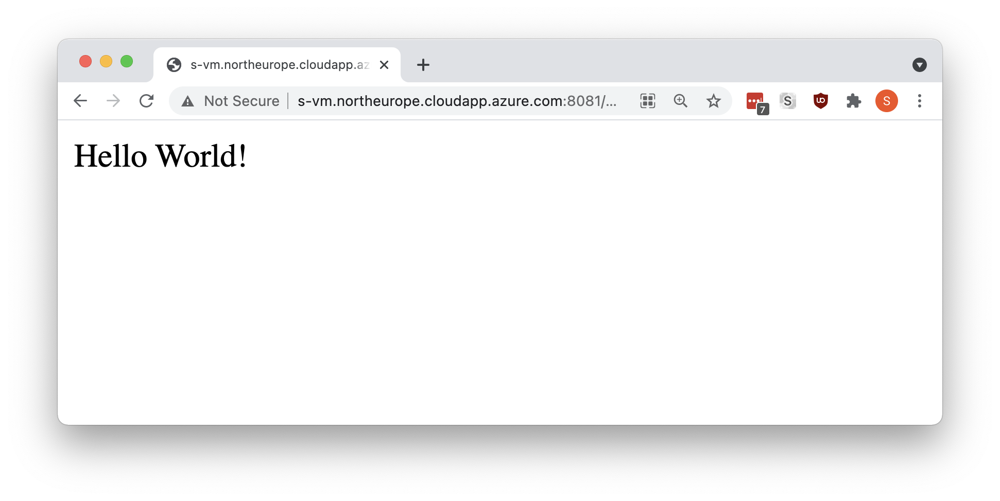

# Fleet management system

## Team
* Monika Rosa
* Godfrey 

## Description
The main objective of this project is to create a IT System for managing car fleet for the company, which consists of a headquarter and few branch offices located in different cities (Lodz, Warsaw, Cracow). Our solution connects the information systems of company's headquarters and its branches and allows enterprise to manage their car fleet. We have prepared working Web Service and Flutter Android client.

### Repositories
Backend repository: https://github.com/Wredter/IAP_project_1

Frontend, documentation and scripts: https://github.com/sosnus/iap-client


## Technology stack

* Database
    * MySQL `MySQL Server 8.0.23-1debian10`
* Backend
    * Java Spring `Spring Boot (v2.4.3)`
* Frontend
    * Flutter `Flutter 2.0.3`
        * Android 
        * Web 
        * Web container 


# Report 1 - Feasibility study of communication between systems

First, test deploy consist of 3 parts:
* MySQL database
* Spring boot backend service
* Flutter Android client

For communication test purpoise, database and backend was deployed on docker containers, on the same Virtual Machine.
* Backend addr: http://s-vm.northeurope.cloudapp.azure.com:8081/
* Database addr: http://s-vm.northeurope.cloudapp.azure.com:3306/

Before container deployment, it is necessary to enable new firewall rules:
```bash
ufw allow 22
ufw allow 3306
ufw allow 8081
ufw reload
```


## Database - deploy and test

For database deployment, we use simple bash script to run new docker container from Docker Hub
```bash
docker run --name  some-mysql -p 3306:3306 -e MYSQL_ROOT_PASSWORD=my-secret-pw -d mysql
```
We test Our database deployment using DBeaver desktop app:


## Backend - deploy and test

To deploy backend application, we need build container from source code and run it, using commands below:
```bash
git clone https://github.com/Wredter/IAP_project_1
cd ./IAP_project_1
docker stop iap-back-container -t 1
docker rm iap-back-container
docker build --no-cache -t iap-back-container --build-arg .
docker run -d -p 80:8081 --name=iap-back-container iap-back
```

Now we can test backend project, by sendd http get request on `/hello` endpoint. In Our case, we can see it on addr: `http://s-vm.northeurope.cloudapp.azure.com:8081/hello`
