# Fleet management system

| ℹ️  |  This documentation is available online [here](https://sosnus.github.io/iap-client/). |
| --- | --- |

## Team

* Monika Rosa 239113
* Godfrey Mghase 239195
* Stanisław Puławski 239111
* Wiktor Muraszko 239109

## Description
The main objective of this project is to create a IT System for managing car fleet for the company, which consists of a headquarter and few branch offices located in different cities (Lodz, Warsaw, Cracow). Our solution connects the information systems of company's headquarters and its branches and allows enterprise to manage their car fleet. We have prepared working Web Service and Flutter Android client.

### **Repositories**
Backend repository [here](https://github.com/Wredter/IAP_project_1).

Frontend repository [here](https://github.com/sosnus/apiconsument).

Documentation, scripts (and special frontend for 1st repo) [here](https://github.com/sosnus/iap-client)

## Technology stack

* Database
    * MySQL `MySQL Server 8.0.23-1debian10`
* Backend
    * Java Spring `Spring Boot (v2.4.3)`
* Frontend
    * Flutter `Flutter 2.2.2`
        * Android 
        * Web 
        * Web container 

### Production deployment
#### Production deployment links

* [HQ Warsaw office](https://iap-warsaw-hq.azurewebsites.net/)
* [BO Lodz office](https://iap-lodz-bo.azurewebsites.net/)
* [BO Cracow office](https://iap-cracow-bo.azurewebsites.net/)

Backend containers are hosted on ASP (App Service Plan) with 28 other applications. ASP based on tier B2 and have: 3.5GB RAM and 2vCPU cores 

Databases containers are hosted on Azure Virtual Machine with a lot of tthers containers and services. VM size: Standard B1ms 1vCPU, 2GB RAM. Containers are separated and are ready to migration.


# TODO: new diagram
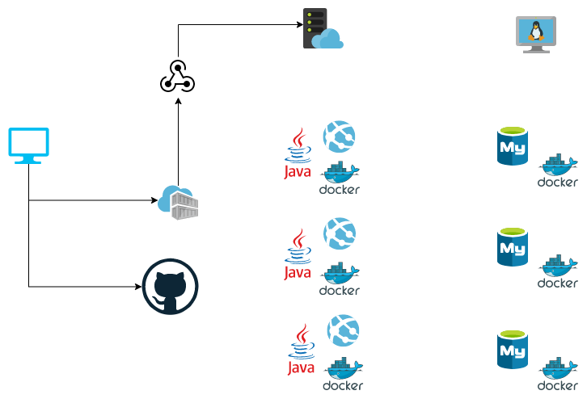

When developer build and push image, webhooks will deploy container at ASP.

```bash
docker login sosnuscontainers.azurecr.io
# login: ********
# password: *********

docker build -t sosnuscontainers.azurecr.io/iap-warsaw-hq .
docker push sosnuscontainers.azurecr.io/iap-warsaw-hq

docker build -t sosnuscontainers.azurecr.io/iap-lodz-bo .
docker push sosnuscontainers.azurecr.io/iap-lodz-bo

docker build -t sosnuscontainers.azurecr.io/iap-cracow-bo .
docker push sosnuscontainers.azurecr.io/iap-cracow-bo

```
# TODO: new backend address


# Report 1 - Feasibility study of communication between systems

| ℹ️  |  the purpose of the first report is presentation connection between database, backend and frontend applications |
| --- | --- |


First, test deploy consist of 3 parts:
* MySQL database
* Spring boot backend service
* Flutter Android client

#### test deployment

For communication test purpouse, database and backend was deployed on docker containers, on the same Virtual Machine. VM size: Standard B1ms 1vCPU, 2GB RAM
* Backend address [here](http://s-vm.northeurope.cloudapp.azure.com:8081/)
* Database address [here](http://s-vm.northeurope.cloudapp.azure.com:3306/)


Before container deployment, it is necessary to enable new firewall rules:
```bash
ufw allow 22
ufw allow 3306
ufw allow 8081
ufw reload
```

## Database - deploy and test

For database deployment, we use simple bash script to run new docker container from Docker Hub

```bash

docker run --name some-mysql -p 3306:3306 -e MYSQL_ROOT_PASSWORD=my-secret-pw -d mysql

```

We create first sql schema for this project using dbdiagram.io tool. Probably we will have some changes here in the future. Online documentation for our schema is [here]( https://dbdiagram.io/d/6053d308ecb54e10c33c2951) 

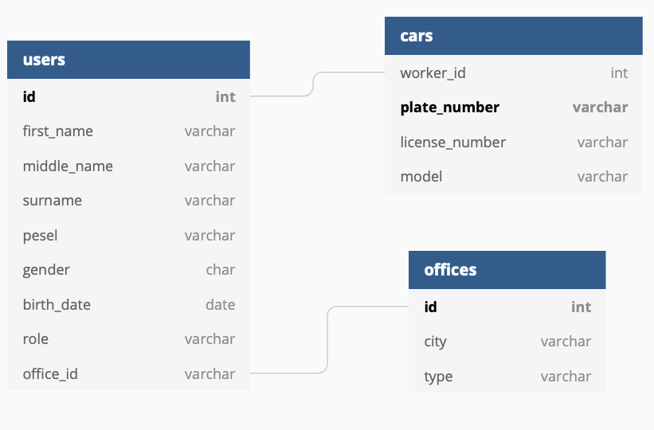

 

Next we create new database users to enable easy synchronous access for the rest of the team members. It is important for future deployments, we need independent user for every backend instance. Here is how we created the users.

```sql
CREATE USER 'moderator1'@'%' IDENTIFIED BY '1234';
GRANT ALL PRIVILEGES ON * . * TO 'moderator1'@'%';
FLUSH PRIVILEGES;

```

Next we add dump data for testing using the script below.

```sql
INSERT INTO `users` (`id`, `first_name`, `middle_name`, `surname`, `pesel`, `gender`, `birth_date`, `role`, `office_id`) VALUES

(1020, 'Ruth', 'Elion', 'Musk', 19021989, 'M', '2020-10-20', 'admin', '23'),
(1021, 'Monika', '', 'Rosa', 19021989, 'F', '1997-04-20', 'client', '24'),
(1023, 'Stanley', '', 'Murashko', 1902198, 'M', '1999-08-09', 'client', '23'),
(1024, 'Godfrey', '', 'Muga', 1902198, 'M', '1999-08-10', 'admin', '24');

INSERT INTO `cars` (`worker_id`, `plate_number`, `license_number`, `model`) VALUES
(1020, '1520', '5060', 'Toyota'),
(1021, '1521', '5061', 'Nissan'),
(1023, '1522', '5062', 'Hundai'),
(1024, '1523', '5063', 'Toyota');

INSERT INTO `offices` (`id`, `city`, `type`) VALUES
(23, 'Lodz', 'HQ'),
(24, 'Warsaw', 'BO');

```

We test Our database deployment using DBeaver desktop app:
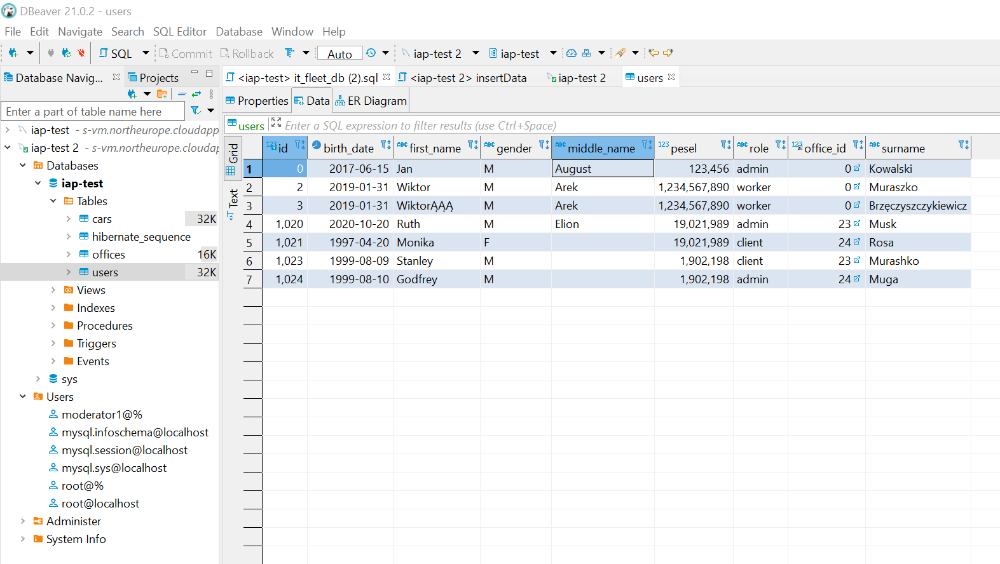


## Backend - deploy and test

To deploy backend application, we need build container from source code and run it, using commands below:
```bash
git clone https://github.com/Wredter/IAP_project_1
cd ./IAP_project_1
docker stop iap-back-container -t 1
docker rm iap-back-container
docker build --no-cache -t iap-back .
docker run -d -p 8081:80 --name=iap-back-container iap-back
```

Now we can test backend project, by send http get request on `/hello` endpoint. In Our case, we can see it on [address](http://s-vm.northeurope.cloudapp.azure.com:8081/hello)`


On endpoint `/users` we can see list of `elements` from `users` collections
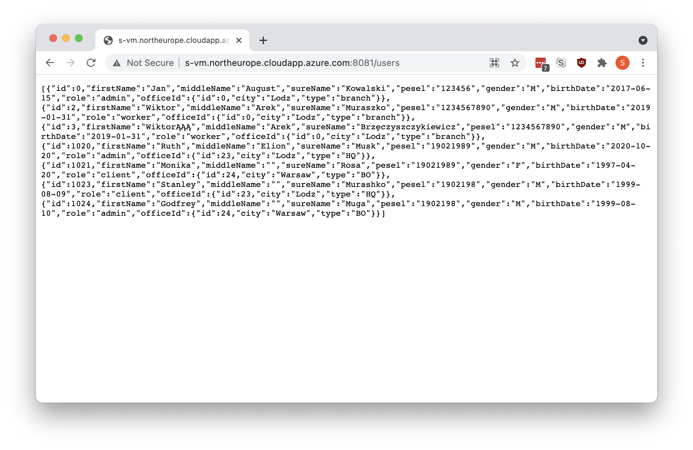


## Frontend - test
For first project iteration, we need implement a few features in frontend application:
* Connection to API
* Users model
* User list view


### Connection to API
Class `FleetService` contains access to backend API using `package:http/http.dart` library
### Users 
User class is very simple, and help us to present data from Users collection from backend. We add it for test purpose, in next iteration this class will be modified, and contain expanded constructors and other methods
```dart
class User {
  int id;
  String pesel;
  String firstName;
  String sureName;

  User({this.id, this.pesel, this.firstName, this.sureName});
}
```

### User list view
Main part of view in this project is builder, which can dynamic add new elements to ListView collection
```dart
Builder(
        builder: (_) {
          if (_isLoading) {
            return Center(child: CircularProgressIndicator());
          }

          if (_apiResponse.error) {
            return Center(child: Text(_apiResponse.errorMessage));
          }

          return ListView.separated(
            separatorBuilder: (_, __) =>
                Divider(height: 1, color: Colors.green),
            itemBuilder: (_, index) {
              return Dismissible(
                key: ValueKey(_apiResponse.data[index].id),
                direction: DismissDirection.startToEnd,
                onDismissed: (direction) {},
                confirmDismiss: (direction) async {
                  final result = await showDialog(
                      context: context, builder: (_) => UserDelete());
                  print(result);
                  return result;
                },
                background: Container(
                  color: Colors.red,
                  padding: EdgeInsets.only(left: 16),
                  child: Align(
                    child: Icon(Icons.delete, color: Colors.white),
                    alignment: Alignment.centerLeft,
                  ),
                ),
                child: ListTile(
                    title: Text(
                      _apiResponse.data[index].sureName,
                      style: TextStyle(color: Theme.of(context).primaryColor),
                    ),
                    subtitle: Text('PESEL: ${_apiResponse.data[index].pesel}'),
                    onTap: () {}),
              );
            },
            itemCount: _apiResponse.data.length,
          );
        },
      ),
```
Application get list of users using service `fleet_service`, convert it into list of `User` objects, and present it as `ListTile` widgets:
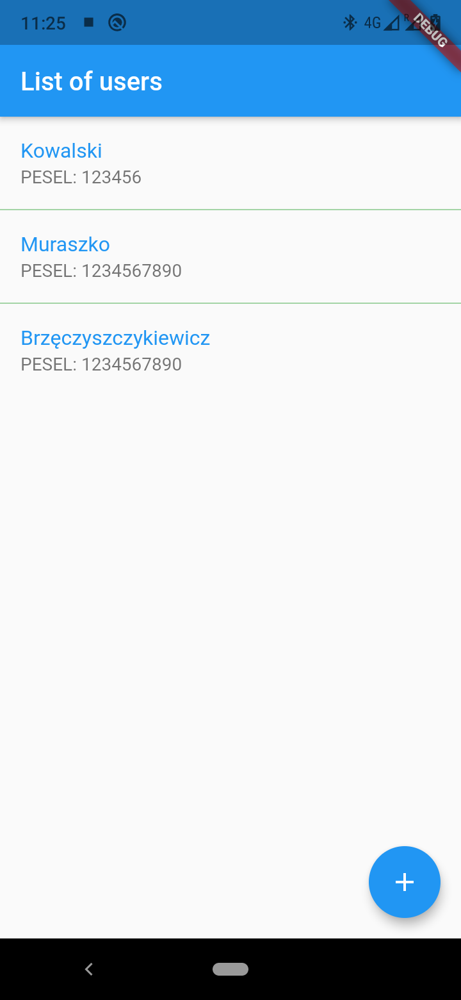

## references and sources for 1st report
* [REST API in flutter](https://www.youtube.com/watch?v=M8zM48Jytv0)
* [Flutter documentation](https://flutter.dev/docs)
* [Create database users](https://www.digitalocean.com/community/tutorials/how-to-create-a-new-user-and-grant-permissions-in-mysql)


# Report 2 - Establish the business context, sketch the system architecture, select technology
## System actors
* Headquarters Manager - Headquarters Manager represents a system role with the authorization to assign car to the branch office, update HQ car details.
* Branch Office Manager - Branch Office Manager represents a system role with the authorization to fill out the request form for the car, assign car to a worker, update BO car details.

## Activity diagram
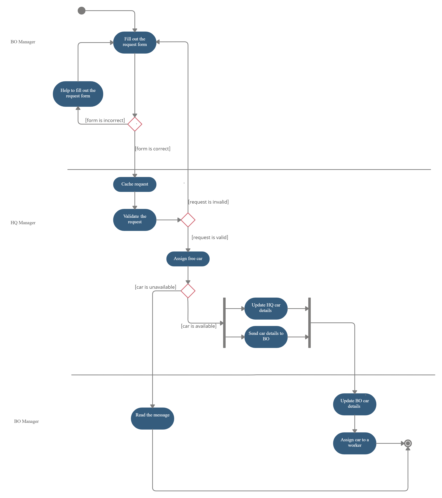

## Deployment diagram


## Description of use cases 
### 1. Fill out the request form (when worker needs new car)
* Type: general 
* Users: Branch Office Manager 
* Initial conditions: Branch Office Manager confirmed their identity via login and password.
* Typical step sequence:  
1. Branch Office Manager chooses an option to fill out the request form. 
2. BO Manager fills out the request form 
* Alternative sequence of steps:  
2a. Request form was filled incorrectly, BO Manager repeats filling process. 
2b. Request form was filled incorrectly, BO Manager displays help video and repeats the process. 
* Final conditions: the request form has been successfully filled. 

### 2. Assign free car (to branch) 
* Type: general
* Users: Headquarters Manager 
* Initial conditions: Headquarters Manager confirmed their identity via login and password. 
* Typical step sequence:  
1. Cache requests
2. The request validation 
3. HQ Manager assigns free car 
4. Update HQ car details 
5. Send car details to BO 
* Alternative sequence of steps: 
2a. The request is invalid (error message is sent to BO)  
3a. There is no free car (notification is sent to BO) 
* Final conditions: the free car has been assigned to BO 

### 3. Assign car to a worker 
* Type: general
* Users: Branch Office Manager 
* Initial conditions: Branch Office Manager confirmed their identity via login and password. 
* Typical step sequence:
1. Branch Office Manager assigns car to the worker. 
2. BO car details are updated. 
* Final conditions: car is assigned to worker.

## References and sources for 2nd report

* [UML deployment diagram guide](http://www.agilemodeling.com/artifacts/deploymentDiagram.htm)
* [UML activity diagram](http://www.agilemodeling.com/style/activityDiagram.htm)

* http://www.agilemodeling.com/artifacts/deploymentDiagram.htm
* http://www.agilemodeling.com/style/activityDiagram.htm


# Report 3 - Implementation of data exchange and synchronization (headquarters(HQ) / offices(BO))
Just an update, this is the HQ and BO setup.
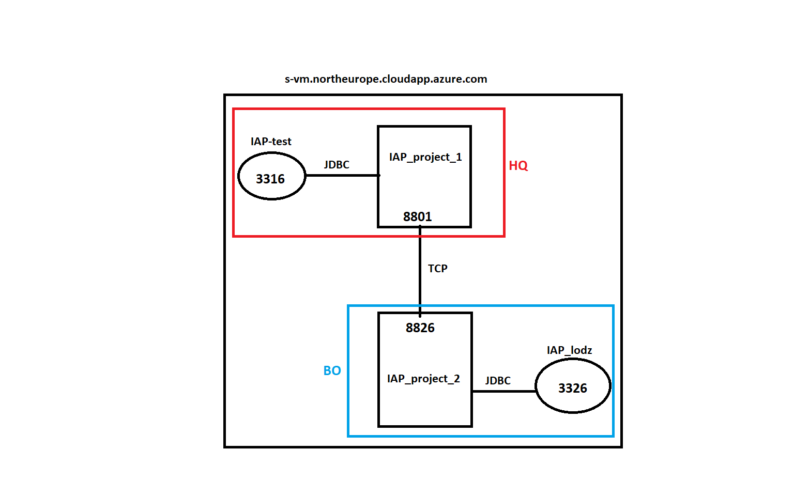

## Data Models
As of now the data models for headquarters and branch office look pretty similar except for the responses model which takes care of all the responses the hq have ever sent to the branch office and some columns entries at branch office model are meant for data synchronization purposes.
### HQ Model
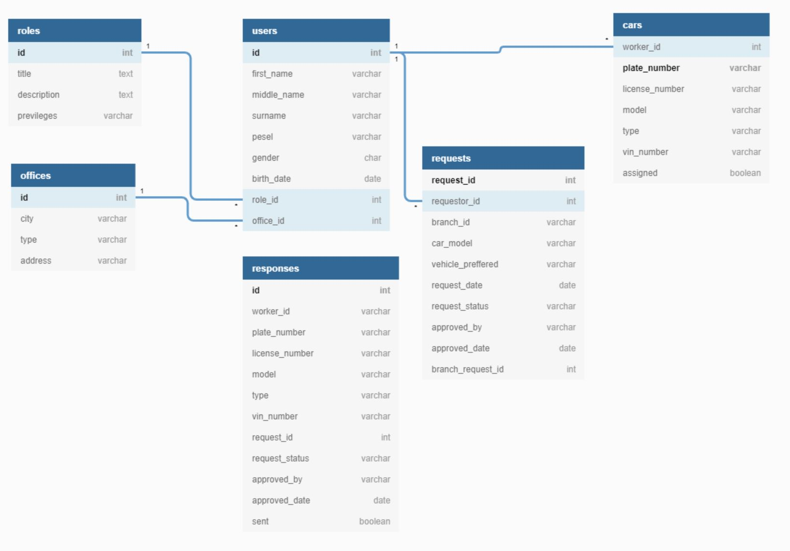
Down below we paste a sample code for the HQ office entity as implemented in our application.
```java

@Entity
@Table(name = "offices")
@NoArgsConstructor
@AllArgsConstructor
@ToString
@Builder
public class Office {
    @Getter
    @Setter
    @Id
    @NotNull
    @Column(name = "id")
    public long id;
     
    @Getter
    @Setter
    @Column(name = "city")
    public String city;

    @Getter
    @Setter
    @Column(name = "type")
    public String type;
    
    @Getter
    @Setter
    @Column(name = "address")
    public String address;
}

```

### BO Model
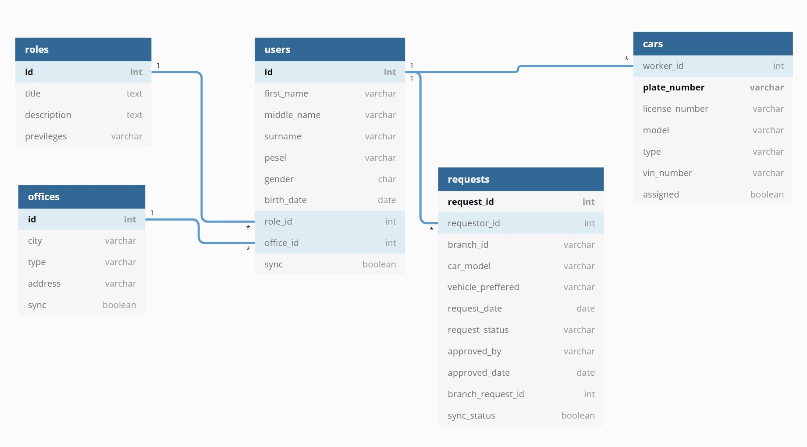
Down below we paste a sample code for the bo users entity as implemented in our application.
```java
@Entity
@Table(name = "users")
@Builder
@AllArgsConstructor
@NoArgsConstructor
@ToString
public class User {
    @Getter
    @Setter
    @Id
    @NotNull
    @Min(40000)
    @Max(60000)
    private long id;
    

    @Getter
    @Setter
    @Column(name = "first_name")
    private String firstName;

    @Getter
    @Setter
    @Column(name = "middle_name")
    private String middleName;

    @Getter
    @Setter
    @Column(name = "surname")
    private String surname;

    @Getter
    @Setter
    @Size(min = 10, max = 12)
    @Column(name = "pesel")
    private String pesel;

    @Getter
    @Setter
    @Column(name = "gender")
    private char gender;

    @Getter
    @Setter
    @Temporal(TemporalType.DATE)
    @Column(name = "birth_date")
    private Date birthDate;


    
    @ManyToOne(fetch = FetchType.LAZY, optional = false)
    @JoinColumn(name = "office_id", nullable = false, referencedColumnName = "id")
    private Office officeId;
    
    @Getter
    @Setter
    @ManyToOne(fetch = FetchType.LAZY, optional = false)
    @JoinColumn(name = "role_id", nullable = false, referencedColumnName = "id")
    private Role roleId;
    
    @Getter
    @Setter
    @Column(name = "sync")
    private Boolean sync;
    

    public User(String firstName, String middleName, String surname, String pesel, char gender, Date birthDate,Role roleId,Office officeId){
        this.firstName = firstName;
        this.middleName = middleName;
        this.surname = surname;
        this.pesel = pesel;
        this.gender = gender;
        this.birthDate = birthDate;
        this.roleId = roleId;
        this.officeId = officeId;
    }
}

```
## Implementation of data exchange and synchronization
We use [RestTemplate](https://docs.spring.io/spring-framework/docs/current/javadoc-api/org/springframework/web/client/RestTemplate.html) class under org.springframework.web.client package to manage data exchange, and for synchronization tasks we use [TaskSchedular interfaces](https://docs.spring.io/spring-framework/docs/3.2.x/spring-framework-reference/html/scheduling.html) in spring boot just by enabling the scheduling at the main application and use @ annotation for each method/class we need to schedule.

Enabling Scheduling in spring boot main application, @EnableScheduling and @EnableSwagger2 for documentation.
```java
package com.IAP.car_exchange;

@RestController
@SpringBootApplication
@EnableScheduling
@EnableSwagger2
public class CarExchangeApplication {

	public static void main(String[] args) {
		SpringApplication.run(CarExchangeApplication.class, args);
	}
	
	public Docket productApi() {
		return new Docket(DocumentationType.SWAGGER_2).select()
		    .apis(RequestHandlerSelectors.basePackage("com.IAP.car_exchange")).build();
		   }

	@GetMapping("/hello")
	public String hello(@RequestParam(value = "name", defaultValue = "World") String name) {
		return String.format("Hello %s!", name);
	}

}

```

### Data exchange and synchronization for branch office
Firstly, assuming the office, role and user have been commissioned already, A user will create a request, this request will be stored in a local branch database and the RestTemplate.postForObject() method will be invoked to transmit this request to headquarter office. Incase any failure, scheduling/synchronization has been enabled in such a way that after every 10 seconds the failed requests will be retransmitted again. Entities like User,Office, and Request have beeen synchronized such that there is a copy of each of them at the HQ server/database.

a. Synchronization properties definition
```java
package com.IAP.car_exchange;

public class SynchronizationConfiguration {
	
	// connection to HQ
	public static final String uriToHq = "http://s-vm.northeurope.cloudapp.azure.com:8081/request";
	public static final String uriToHqUser = "http://s-vm.northeurope.cloudapp.azure.com:8081/user";
	public static final String uriToHqOffice = "http://s-vm.northeurope.cloudapp.azure.com:8081/office";

	// connection from HQ
	public static final String  uriFromHq = "details";
	
	// delay sync timer in millisecond
	public static final int delay = 10000;

}

```
b. Synchronization service controller
```java
@RestController
public class SyncronizationController {
	
	
	@Autowired
	SyncronizationService syncronizationService;
	@Autowired
	SynchronizeUserService synchronizeUserService;
	@Autowired
	SynchronizeOfficeService synchronizeOfficeService;
	
	private static final Logger logger = LoggerFactory.getLogger(SyncronizationController.class);
	private static final DateTimeFormatter dateFormat = DateTimeFormatter.ofPattern("HH:mm:ss");

	
	@Scheduled(fixedDelay=SynchronizationConfiguration.delay)
	public void synchronizeRequests() {
		logger.info("Scheduled Synchronization Task for requests :: Execution Time - {}",dateFormat.format(LocalDateTime.now()));
		try {
			ResponseEntity<String> sync = syncronizationService.tryToSync();
		} catch(Exception ex) {
			logger.error("We have run into an error: we will reconnect shortly");
		}
	}
	
	@Scheduled(fixedDelay=SynchronizationConfiguration.delay)
	public @ResponseBody void synchronizeUsers() {
		logger.info("Scheduled Synchronization Task for users :: Execution Time - {}",dateFormat.format(LocalDateTime.now()));
		
		  try { ResponseEntity<String> sync = synchronizeUserService.syncUsers(); }
		  catch(Exception ex) {
		  logger.error("We have run into an error: we will reconnect shortly"); 
		  throw ex; 
		  }		
	}
	
	@Scheduled(fixedDelay=SynchronizationConfiguration.delay)
	public @ResponseBody void synchronizeOffices() {
		logger.info("Scheduled Synchronization Task for Offices :: Execution Time - {}",dateFormat.format(LocalDateTime.now()));
		
		  try { ResponseEntity<String> sync = synchronizeOfficeService.syncOffices(); }
		  catch(Exception ex) {
		  logger.error("We have run into an error: we will reconnect shortly"); 
		  throw ex; 
		  }		
	}

}

```
c. Sychronization service implementation for requests as an example.

```java
@Repository
@Data
public class SyncronizationService {
	final RequestRepository requestRepository;
	
	RequestData requestData = new RequestData();
	
	  public SyncronizationService(RequestRepository requestRepository) {
	  this.requestRepository = requestRepository; }
	 
	
	public List<Request> getAllUnsycedRequests(){
		
		return requestRepository.getAllUnyced();
	}
	
	public ResponseEntity<String> tryToSync(){
		
		
		/*
		 * List<Request> requests = syncronizationService.getAllUnsycedRequests();
		 * if(requests.isEmpty()) { System.out.println("am empty "+requests); }
		 */
		List<Request> requests = getAllUnsycedRequests();
		if (requests.isEmpty() == false) {
			for(Request r:requests) {
				//System.out.println(r.getRequestorId());
				
				// Prepare the data to be sent to HQ for this request

				requestData.setRequestorId(r.getRequestorId().getId());
				requestData.setBranchId(r.getBranchId());
				requestData.setCarModel(r.getCarModel());
				requestData.setVehiclePreffered(r.getVehiclePreffered());
				requestData.setRequestDate(r.getRequestDate());
				requestData.setRequestId(r.getRequestId());
				
				// Now send it
				//String uri = "http://localhost:8080/request";
				RestTemplate restTemplate = new RestTemplate();
				try {
				RequestData result = restTemplate.postForObject(SynchronizationConfiguration.uriToHq,requestData, RequestData.class);
				} catch(Exception e) {	
					System.out.println("We are sorry something happened we will try again later!");
					//System.out.println(requestData.getRequestorId());
					//e.printStackTrace();
					throw e;	
				}
				
				// If success, change the sync status
				r.setStatus(true);
				requestRepository.save(r);
			}
		}

		return ResponseEntity.ok(null);
	}

}

```
### Data exchange and synchronization for head quarter office
Here, we transfer and synchnronize all the responses we have ever sent to branch office. After we receive the car request from branch office, we log it into the requests table and then the headquarter manager can check the pending requests, find the requested car by filtering, copy the requestid and just hit assign button and the car assignment process will proceed. Under the hood, if the car is found it's detail is packed and sent to the branch office and the necessary updates in the hq table entities is performed. If not found then the rejection notification is appended on the response. Again, the neccessary fields are updated to tell that this particular request has been processed.

#### Background services
a. Sychronization properties definition
```java
package com.IAP.car_exchange;

public class SynchronizationConfiguration {
	
	// connection to BO
	public static final String uriToBo = "http://s-vm.northeurope.cloudapp.azure.com:8826/details";
	
	// connection from BO
	public static final String  uriFromBo = "request";
	
	// delay sync timer in millisecond
	public static final int delay = 5000;

}

```

b. Responses synchronization controller

```java
@RestController
public class ResponsesSyncController {
	@Autowired
	ResponsesSycService responsesSycService;
	
	private static final Logger logger = LoggerFactory.getLogger(ResponsesSyncController .class);
	private static final DateTimeFormatter dateFormat = DateTimeFormatter.ofPattern("HH:mm:ss");
	
	
	@Scheduled(fixedDelay=SynchronizationConfiguration.delay)
	public void synchronizeResponses() {
		logger.info("Scheduled Synchronization Task :: Execution Time - {}",dateFormat.format(LocalDateTime.now()));
		try {
			ResponseEntity<String> sync = responsesSycService.tryToSync();
		} catch(Exception ex) {
			logger.error("We have run into an error: we will reconnect shortly");
		}
	}

}

```
c. Responses synchronization service

```java
@Repository
@Data
public class ResponsesSycService {
	
	final ResponsesRepository responsesRepository;
	
	Response response = new Response();
	
	public ResponsesSycService(ResponsesRepository responsesRepository) {
		this.responsesRepository = responsesRepository;
	}
	
	public List<Responses> getAllUnsycedResponses(){
		
		return responsesRepository.getAllUnsyc();
	}
	
	
	public ResponseEntity<String> tryToSync(){
		
		List<Responses> responses = getAllUnsycedResponses();
		if (responses.isEmpty() == false) {
			for(Responses r:responses) {
				// Prepare the data to be sent to HQ for this request
				response.setWorkerId(r.getWorkerId());
				response.setPlateNumber(r.getPlateNumber());
				response.setLicenseNumber(r.getLicenseNumber());
				response.setModel(r.getModel());
				response.setType(r.getType());
				response.setVinNumber(r.getVinNumber());
				response.setRequestId(r.getRequestId());
				response.setRequestStatus(r.getRequestStatus());
				response.setApprovedBy(r.getApprovedBy());
				response.setApprovedDate(r.getApprovedDate());
				
				// Now send it
	
				RestTemplate restTemplate = new RestTemplate();
			try {
			Response result = restTemplate.postForObject(SynchronizationConfiguration.uriToBo,response, Response.class);
			} catch(Exception e) {	
				System.out.println("We are sorry something happened we will try again later! "+e);
					throw e;	
				}
				
				// If success, change the sync status
				r.setSent(true);
				responsesRepository.save(r);
			}
		}

		return ResponseEntity.ok(null);
	}

}

```
#### Service layer descriptions
Here, we explain how we implemented the car request service. We should note that, CRUD operations have also been implemented for all the data models. Follow along the following steps:-
1. A bo user create a request -- Data access layer
   ```java
   @Data
   public class RequestData {
      Long requestId;
      Long requestorId;
      Long branchId;
      String carModel;
      String vehiclePreffered;
      Date requestDate;
      String requestStatus;
      String approvedBy;
      Date approvedDate;
      String assignedCar;
      Boolean status;
   }
 
   ```
   Data access interface - the repository
   
   ```java
   package com.IAP.car_exchange.repository;

   import java.util.List;
   import org.springframework.data.jpa.repository.JpaRepository;
   import org.springframework.data.jpa.repository.Query;

   import com.IAP.car_exchange.Model.Request;

   public interface RequestRepository extends JpaRepository<Request,Long> {
      @Query(value = "SELECT * FROM requests r ORDER BY r.request_id DESC LIMIT 1", nativeQuery = true)
      Request getLastRecord();

      @Query("SELECT r FROM Request r WHERE r.requestId=?1 AND r.assignedCar != null")
      Request getUnassignedCar(Long requestId);

      @Query("SELECT r FROM Request r WHERE r.status != true")
      List<Request> getAllUnyced();
   }
   
   ```
2. The request is stored in the database --- service layer

   A request controller
   
   ```java
   @RestController
   public class RequestController {
      @Autowired
      Querries DataAccess;

      @PostMapping("request")
      @JsonIgnoreProperties({"hibernateLazyInitializer", "handler"})
       public @ResponseBody
       ResponseEntity<String> createRequest(@RequestBody RequestData dataHolder){

         // Log this Request Locally
           Request request = DataAccess.addRequest(
               dataHolder.getRequestorId(),
               dataHolder.getBranchId(),
               dataHolder.getCarModel(),
               dataHolder.getVehiclePreffered(),
               //dataHolder.getRequestDate()
               new Date()
               );       

           return ResponseEntity.ok(null);
       }

      @GetMapping("requests")
      public @ResponseBody Iterable<Request> getRequests(){
         return DataAccess.getAllRequests();
      }

       @GetMapping("request/{id}")
       public Request getRequest(@PathVariable Long id){
           return DataAccess.getRequestById(id);
       }

       @DeleteMapping("_request/{id}")
       public ResponseEntity<String> deleteRequest(@PathVariable("id") Long id){
           DataAccess.deleteRequest(id);
           return ResponseEntity.ok("Removed");
       }

   }
    
   ```
   
   A request service method for adding a request only
   
   ```java
      public Request addRequest(Long requestorId,Long branchId,String carModel,
    		String vehiclePreffered,Date requestDate) {
        User user = userRepository.findById(requestorId)
                .orElseThrow(() -> new IllegalArgumentException("Invalid requestor Id: " + requestorId));
        Office office = officeRepository.findById(branchId)
                .orElseThrow(() -> new IllegalArgumentException("Invalid branch Id: " + branchId));
    	Request request = Request.builder()
    			.requestorId(user)
    			.branchId(branchId)
    			.carModel(carModel)
    			.vehiclePreffered(vehiclePreffered)
    			.requestDate(requestDate)
    			.status(false)
    			.build();
    	requestRepository.save(request);
    	return request;
    }
   
   ```
   If successfully, the requests is transfered to the hq for further processes.
   
3. The hq manager will manage the requests, via the AssignCarController service
   ```java
   @RestController
   public class AssignCarController {

	@Autowired
	Querries DataAccess;
	
	@GetMapping("pendingrequests")
	public @ResponseBody Iterable<Request> getPendingRequest(){
		return DataAccess.getPendingRequests();
	}
	
	@GetMapping("filter/{model}/{type}")
	public @ResponseBody Iterable<Car> getCarByFilter(@PathVariable String model, @PathVariable String type) {
		return DataAccess.getCarByModelType(model, type);
	}
	
	@PostMapping("assign/{requestId}")
		public @ResponseBody 
		ResponseEntity<String> assign(@PathVariable Long requestId){
		Response response = DataAccess.assign(requestId);
		return ResponseEntity.ok(null);
		}
   
   ```
   At the end, the synchronization service will take of the rest, including sending back the response once the request has been attended.


```markdown
## Report task (description)
https://ftims.edu.p.lodz.pl/mod/assign/view.php?id=34532
Report - stage 3
Determine data models (headquarters / branches),
Implementation of data exchange and synchronization (headquarters / branches)
Required elements:

background service (in headquarter and/or branch server) that performs periodic data synchronization
fault tolerance when connection between HQ and branches is not available (try to synchronize next time)
Also:
completion of service layer, and user interface in client applications
presentation of running applications
presentation of data exchange or data synchronization between headquarters and branches

TODO:
* Figma models
* Backend implementation:
  * CRUD
  * Authorisation
  * Business layer
  * Unit test
  * find way to pass run arguments after build (like connection string or sth)
* Frontend
  * Login
  * All views
  * Unit test
* Database
  * DB for every deployment (2x BO, 1x HQ)
```


.

.

.

.

.

.

.

.

.

.

.

.

.

.

.

.

.

.

.

.

.

.

.

.

.


| Request form | Request list | Request liew |
| --- | --- |--- |
| 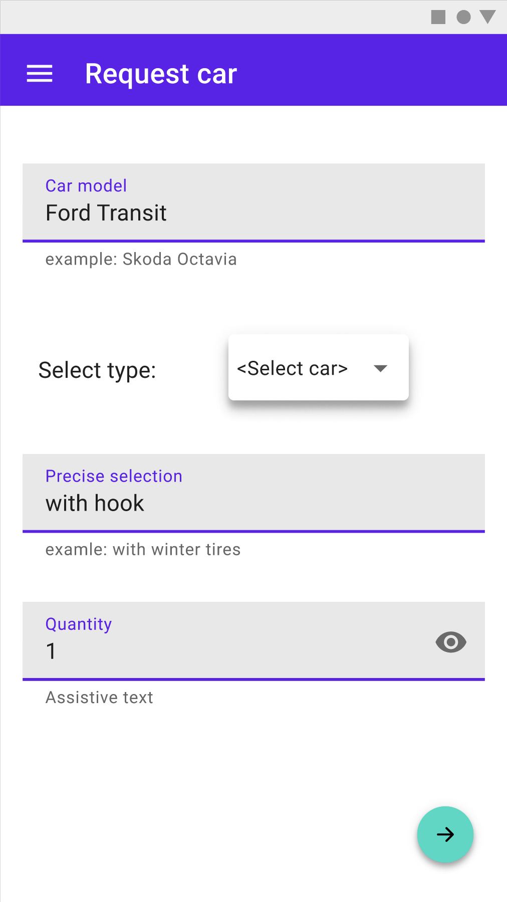 | 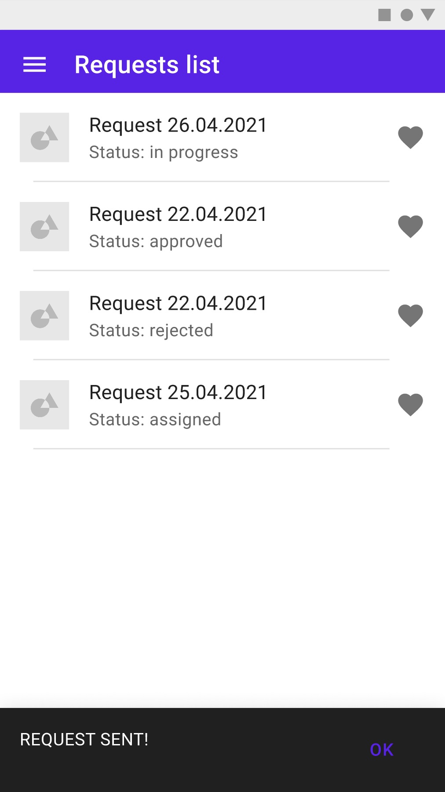 |  |
| --- | --- |--- |
 
